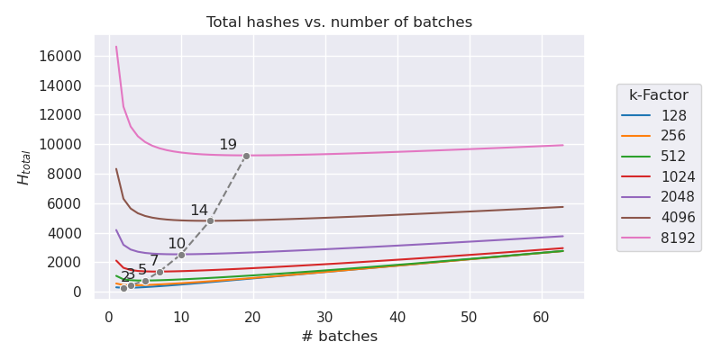
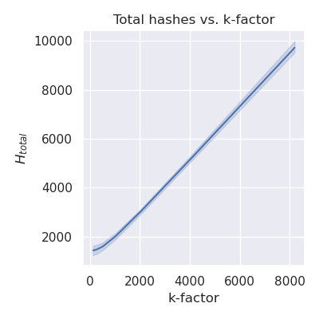
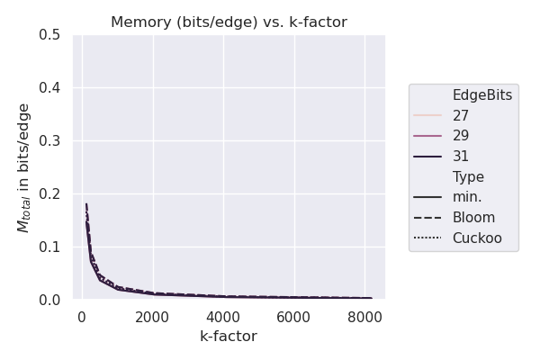
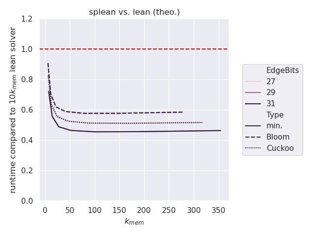
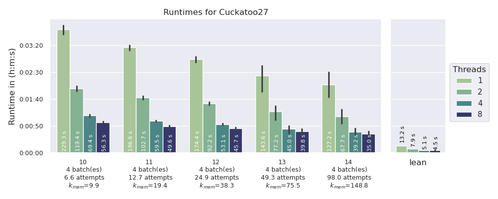
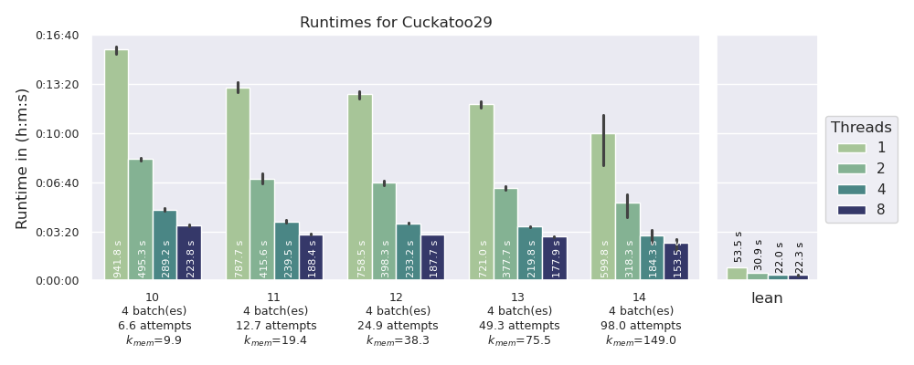
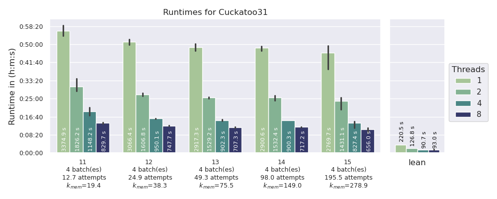
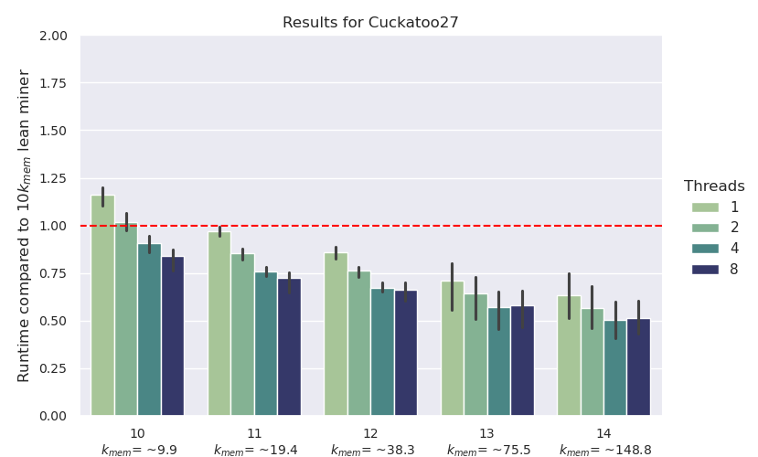
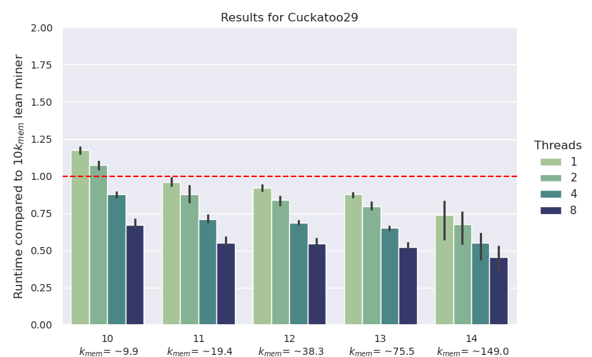
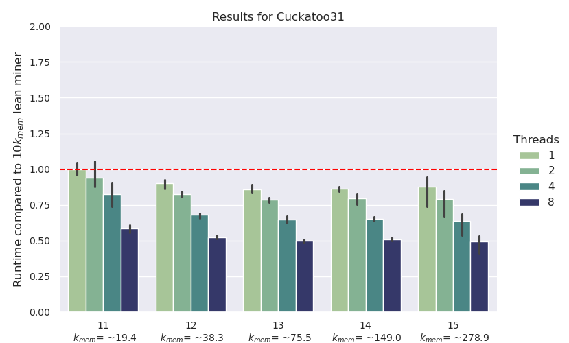

# Abstract

This is my attempt to claim the [Linear Time-Memory Trade-Off bounty from John Tromp for the Cuckoo Cycle problem][1]. This new algorithm is inspired by a comment from Dave Andersen[^1] that this problem might be amenable to a sampling-based approach. Additionally, this algorithm leverages probabilistic set data structures to finally meet the challenge posed by John Tromp. An implementation in C++ can be found [here](src/). If you are interested in more details please keep reading, otherwise you can compile the source code yourself and compare the memory consumption and execution time vs. the [lean solver reference implementation from John Tromp][3].

# Introduction

Here I present a new algorithm for Cuckoo Cycle finding to claim the [Linear Time-Memory Trade-Off bounty from John Tromp][1]:

> $10000 for an open source implementation that uses at most N/k bits while finding 42-cycles up to 10 k times slower, for any k>=2.

The whole idea for this algorithm started with a comment (I read somewhere on the internet [^1]) stating that Cuckoo Cycle finding might be amenable to sampling based approaches; meaning that if a graph contains a 42-cycle, a subset of 10% of the edges in the graph is extremely likely to contain at least one of the edges from the cycle. I felt that there should be a way to exploit this observation to challenge the claim about memory consumption and running time from John Tromp mentioned above.  
However, it was not easy and it took me quite a while to figure out how to turn this idea into reality. In the following, I will outline and explain my approach in detail. If you are not interested in the details, you can simply read the [abstract section](#abstract) and check the [code repository](src/) to verify by yourself whether the algorithm does what I claim.  
If you are interested in the details, please go on reading. I have structured this document as follows. First, I will give some essential [background information](#background). Then, I will describe the [general idea](#general-idea) and assess its feasibility in [theory](#theoretical-assessment). In the [forth section](#practical-implementation), I will describe what was needed to finally make it and come up with an implementation that works in practice. In the following fifth section, I will show some [runtime and memory consumption results](#testing-and-validation) from test runs. I also compare the results to the lean solver from John Tromp. Finally, I will end this document with some [concluding words](#conclusion).

# Background

In 2015 John Tromp introduced the first [graph-theoretical Proof-Of-Work (PoW) system][6], by proposing the Cuckoo Cycle problem[^2].
Cuckoo Cycle is immune to quantum speedup by Grover's search algorithm, memory bound, and yet offers nearly instant verification[^3]. It is also a very simple PoW, with a 42-line [complete specification in C][4] and a 13-line [mathematical description][5]. Cuckoo Cycle's challenge is to find a cycle of length L in a random bipartite graph with average degree 1. The reason for calling the resulting PoW Cuckoo Cycle is that inserting items into a Cuckoo hashtable[^4] naturally leads to cycle formation in random bipartite graphs.

The graph is created by a keyed hash function[^9], which maps an edge index and partition side (0 or 1) to the edge endpoint on that side. This makes verification trivial: derive the key of the hash function from the header, compute the 2xL edge endpoints (2xL hashes needed) and make sure that you come back to the starting edge only after traversing L edges. While verification is easy, finding an L-cycle is not. Cycles of length L occur with frequency approximately 1/L.[^2]

John Tromp proposed to use Siphash-2-4 as the hash function for mapping edges to nodes and a cycle length of 42.[^5] He also presented two different algorithms to solve the Cuckoo Cycle PoW, called "lean" and "mean".[^5]

The lean solver is based on an idea by Dave Andersen.[^6] He suggested to first reduce the number of edges drastically before using the standard backtracking graph traversal algorithm to find all cycles and report those with correct length. Lean mining works by a process called edge trimming. The algorithm repeatedly identifies nodes of degree one and eliminates their incident edges, because such leaf edges (over 99.9% of all edges) can never be part of a cycle. Trimming is implemented by maintaining a set of alive edges and a vector of counters (one per node) to count incident edges. Per trimming round, in a first step (called marking/counting) all (still) alive edges are processed, their endnodes for one side are calculated and there respective counters updated.
Then, in a second step (called trimming) edges are only kept alive if their endnodes' counters are >=2 (so not leaf nodes). After this, in the next round, the other side of endnodes is treated the same way. Trimming rounds are repeated until the amount of alive edges is reduced enough to efficiently use the standard algorithm. 99% of the time the solver needs, is spent in this trimming part. The solver is bottle-necked by accessing node bits completely at random, making it memory latency bound. 
How much trimming rounds are needed? To answer this questions, in 2019, John Tromp came up with the Cuckoo conjecture[^8], which let one calculate the edges alive after each round of trimming. A proof attempt was publish in 2022 by Grigory[^9]. 
Assuming that in the lean solver approach in each round two Siphash calculations are needed per edge alive, one in the marking/counting step and one in the second trimming part, the Cuckoo conjecture can be used to calculate the total number of needed Siphashes, which seems to converge to ~5.655 hashes/edge.

The current version of the Cuckoo Cycle problem (termed Cuckatoo) is somewhat more ASIC friendly than the original version. Cuckatoo Cycle is a variation of Cuckoo Cycle that simplifies the algorithm for ASICS by reducing ternary counters to plain bits. To achieve this goal, the cycle definition was changed to a node-pair-cycle. In a node-pair-cycle, consecutive edges are not incident on a single node, but on a node-pair, that is, two nodes differing in the last bit only. In this setting, the lean solver uses 1 bit per edge and 1 bit per node in one partition (or 1 bit per $2^k$ nodes with linear slowdown), which is for Cuckatoo-29 (a graph with $2^{29}$ edges) 1 Gbit (or 128 MB) of random-access memory.
Mean solver avoids using a vast amount of random-access memory by bucketing the edges first. It needs much more memory, but it is 4x faster and memory bandwidth bound[^9].

In his white paper John Tromp states[^5]:
> We will not strive for provable lower bounds on memory usage. [...] Instead, we present an efficient proof-finding algorithm along with our best attempts at memory-time trade-offs, and conjecture that these cannot be significantly improved upon.

Consequently, he offers on [his github website a bounty](https://github.com/tromp/cuckoo?tab=readme-ov-file#linear-time-memory-trade-off-bounty) of 
> $10000 for an open source implementation that uses at most N/k bits while finding 42-cycles up to 10 k times slower, for any k>=2.[^11]

# General idea

Based on the observation by Dave Andersen [^6] that a sampling of 10% of the edges in the graph is extremely likely to contain at least one of the edges in the 42-cycle, the general idea is to sample a subset of the edges and then to check if one of those edges is part of a 42-cycle. 
To determine if an edge is part of a 42-cycle, we can start at one of the nodes of this edge and walk our way along the graph for 42 steps, eventually coming back from where we started, showing that the edge is part of a 42-cycle. However, to walk one step from a current node, we need to know which is the next edge to take. Unfortunately, it is not feasible to pre-calculate all edges with their endnodes and produce a dictionary where we can look up the next step. This would need too much memory. However, what we can do is the following. We can maintain a list of the current endnodes of our paths. Then, for every step we simply calculate all N edges of the graph. And while doing so, we check if the current edge matches any of our paths' current endnodes. If this is true, we walk along that edge and update the respective path’s endnode. After 42 rounds we check if we came back from where we started. If so, we have found an edge that is potentially part of a 42-cycle. However, we cannot be sure that we have found a valid cycle, and we cannot (yet) state all edges of the cycle. We only know the potential first edge of a cycle. Therefore, we have to "walk" all edges again, but this time we record the full path and make sure the cycle is proper. Because the amount of potential edges should be much smaller than our fraction of edges we have started with, we can now afford building a full forest/tree structure to be able to reconstruct the cycle for reporting at the end. This algorithm is outlined in

#####  Listing 1:

~~~
method step(NodeSet, Side, Graph) -> EdgeList
    for each edge in Graph:                                 # loop of N times
        calculate node for Side and
        check if if is paired in NodeSet                    # paired in the meaning of forming a Cuckatoo node-pair
        if true store edge in EdgeList

method walk(EdgeList, kFact, Graph) -> EdgeList
    Side = 0                                                # 0 means u-side, 1 means v-side
    for 41 steps:                                           # loop of 41 times
        clear NodeSet
        for each edge in EdgeList:
            calculate node for Side and store it in NodeSet
        clear EdgeList
        EdgeList <- step(NodeSet, Side, Graph)
        change sides (Side ^= 1)
    for each edge in EdgeList:
            calculate node for Side and store it in NodeSet
    clear EdgeList
    for the first 1/kFact edges in Graph
        calculate node for Side and
        check if it is paired in NodeSet                    # paired in the meaning of forming a Cuckatoo node-pair
        if true store edge in EdgeList                      # EdgeList contains all edges that are potentially part of a 42-cycle

method check(EdgeList, Graph) -> CuckatooCycle
    set up Forest PathForest
    for each edge in EdgeList:
        insert edge as root of a tree in PathForest
    Side = 0
    for 42 steps:                                           # loop of 42 times
        for each edge in Graph:                             # loop of N times
            calculate node for Side and
            check if it is paired with a leaf (of any tree) # paired in the meaning of forming a Cuckatoo node-pair
            if true extend tree by this edge
        change sides (Side ^= 1)
    check if any of the leafs cycles back to the root of the tree
    if true a 42-cycle is found:
        walk back from leaf to root and record edges in CuckatooCycle 

method trim(kFact, Graph) -> EdgeList
    set up counting set NodeSet
    Side = 1                                                # Trim on other side
    for the first 1/kFact edges of Graph
        calculate node for Side and store it in NodeSet     # count is 1
    for each edge in Graph                                  # loop of N times
        calculate node for Side and
        check if it is paired in NodeSet
        if true increase counter in NodeSet
    for the first 1/kFact edges of Graph
        calculate node for Side and
        check if node for Side has count > 1 in NodeSet
        if true store edge in EdgeList

method splean(kFact, Graph) -> CuckatooCycle
    EdgeList <- trim(kFact, Graph)
    EdgeList <- walk(EdgeList, kFact, Graph)
    CuckatooCycle <- check(EdgeList, Graph)

~~~

The algorithm starts by calling the method "splean" with a Cuckoo Graph (specified through header and other parameter) and the fraction of edges (kFact) to start with.
Listing 1 contains already an easy optimization. It includes a trimming step at the beginning. This reduces the amount of edges to test to $1-\frac{1}{e} \approx 63.2\%$.

However, this algorithm immediately sparks a couple of points to address:

### 1. What is with branching?

If there is more than one possible path from a current endnode, would that not mean that the amount of paths / endnodes to store would grow with each step. Only a small growth factor would blow up quickly if raised to the power of 42. Luckily, this is not the case. The [average node degree is 1](#notation-and-useful-facts) and so the amount of endnodes to store stays pretty constant with small variance.

### 2. What is with running into shorter cycles? 

Luckily, running into shorter cycles is not a big problem. According to John Tromp for large graphs the expected number of L-cycles is roughly ~1/L.[^13]
Therefore we expect on average $\sum_{i \in \\{2,6,14\\}}{\frac{1}{i}} \approx 0.74$ potential cycles in a 42 graph, a very small number of (extra) paths; and only cycles of length 2, 6 and 14 (even factors of 42) will end up in the same endnode after 42 steps and therefore present a false-positive result. The chance that we hit one of these cycles with our subset of 1/k starting edges is even lower than hitting a 42-cycle (see [Notation and useful facts](#notation-and-useful-facts)).

### 3. How do we avoid just walking back and forth the same edge?

If we only store the endnodes of our paths then we do not know where we came from and walking back the same edge on the next step would be a possibility. Our average node degree would artificially rise to ~2 and the amount of active paths would blow up quickly. To avoid this, we must keep track of the previous edge (or node), which would increase our memory consumption.
Luckily, the current implementation of Cuckoo Cycle (termed Cuckatoo) is a so called node-pair-cycle, which means that edges are called consecutive in a cycle, not if they hit the same node, but if their two endnodes differ in the last bit. This nicely avoids our problem of possibly walking forth and back, because now the same edge we came from does not qualify anymore as next edge to walk on.

### 4. When do we switch to a new graph?

In principle, we have the choice to switch to a new cycle after checking the subset of 1/k edges. However, if the subset is very small compared to the total amount of edges N, then it might be beneficial to not directly switch to a new graph but just test the next subset of 1/k edges. We could do this for many such subsets before switching to the next graph (batching). When and if such an approach is beneficial will be addressed in the next section. For now we should simply allow this possibility.
Batching also allows for another optimization. We can check the potential cycle candidates from the previous batch during the "walk" step of the current batch. This is beneficial because we calculate all edge endnodes anyways during the "walk" step, so we can make double use of these Siphash calculations. However, this means an increase in memory usage as we now need to keep the PathForest structure besides the NodeSet in memory. If the amount of potential cycles is low (high k-facor) this intertwining allows for "hiding" the extra "check" step at the end almost completely. In the next section, we will analyze this in more detail.

# Theoretical assessment

In this section, I will first assess if the approach outlined above is (at least in theory) feasible.

### 1. Amount of Hashes needed

Let us assume our graph contains a 42-cycle. Then the chance that one particular edge of the cycle is not part of our subset of edges is $1-1/k$. To miss the cycle completely, none of the edges must be part of the subset, so this chance is:
$(1-\frac{1}{k})^{42}$. Consequently, the chance of finding a cycle if it is there is: $1-(1-\frac{1}{k})^{42}$, or if we use $B$ batches:
$1-(1-\frac{B}{k})^{42}$. Finding a 42-cycle in graphs follows a Geometric distribution. Therefore, we would need to try $A = \frac{1}{1-(1-\frac{B}{k})^{42}}$ more cycles than with a non-probabilistic approach (e.g. lean solver).
By analyzing the algorithm in [Listing 1](#listing-1), let us now calculate the amount of Siphash calculations (relative to the total amount of edges $N$) needed for one solving attempt. For the "trimming" step, $H_{trim} = \frac{1}{k}+1+\frac{1}{k}$ hashes are needed. For the walk step $H_{walk} = 41 \cdot (\frac{1}{k} \cdot (1-\frac{1}{e}) + 1) + \frac{1}{k} \cdot (1-\frac{1}{e}) + \frac{1}{k}$ hashes are needed. The factor $(1-\frac{1}{e})$ comes from the "trimming" step, and we used the fact that the average node degree is 1, and that the amount of edges does not change notably from step to step. The "check" step needs 42 hashes plus a small amount to calculate the root nodes of the trees. If we estimate this amount by $\frac{N}{k^2}$, we have combined $H_{check} = 42 + \frac{1}{k^2}$ hashes per edge.
With the batching approach:

$$ H_{total, splean} = A \cdot (B \cdot (H_{trim} + H_{walk}) + H_{check}) = \frac{B \cdot (\frac{3}{k}+42 \cdot \frac{1}{k} \cdot (1-\frac{1}{e}) + 42) + 42 + \frac{1}{k^2}}{1-(1-\frac{B}{k})^{42}} $$

hashes per edge are needed in total.

For each fraction $\frac{1}{k}$ there is an optimum batch number $B$. The following graph plots the total hashes $H_{total}$ vs. the number of batches $B$ of different fractions $\frac{1}{k}$.

The dashed gray line shows the minima. The numbers next to the markers state the number of batches where the minimum is achieved.
However, one can see that the minima are quite flat. For smaller k-factors, not to make use of batching is only slightly worse, while using it comes with extra memory demands.

The next graph shows the amount of total hashes needed per k-factor:

For higher k-factors the relationship is pretty linear with a slope near 1 and an offset near 1000 hashes.
So, when using half the edges to start with, double the amount of hashes are needed to find 42-cycles. In the next section we will see that the true amount of used memory ($k_{mem}$) depends also linearly on the k-factor (and therefore on the fraction/amount of edges we start with).

### 2. Amount of Memory needed

Now, let us estimate the amount of memory that this approach uses. In total 4 different data structures are needed. first, a way fo strong the list of edges efficiently is needed. As the edges are always in increasing order and the deltas between edges follow a [Geometric distribution](https://en.wikipedia.org/wiki/Geometric_distribution) with mean $\frac{1}{p} = k$. A [Golomb-Rice code](https://en.wikipedia.org/wiki/Golomb_coding)[^14] comes to mind to store the edges in a compressed way. The expected amount of bits ($R_k$) needed to store an edge is:
$E(R_k) = b+\frac{1}{1-\alpha^k}$ with $\alpha = (1-p) = (1-\frac{1}{k})$ which is for big k-factors $\approx log_2(k) + 1.58$ ([see here](bitrate_of_golomb_rice.md)).
As stated before the amount of edges stays more or less constant in each step, so in total a minimum of
$M_{edges} = \log_2(k) + 1.58$ bits per edge are needed.
Additionally, a set data structure to store the endnodes is needed. More precise, we only need to query if a node was stored in the set not the precise node itself. Even better, we can tolerate a small amount of false-positive answers. So, it seems possible to use a more space efficient probabilistic filter data structure (like [Bloom filter](https://en.wikipedia.org/wiki/Bloom_filter), [Cuckoo filter](https://en.wikipedia.org/wiki/Cuckoo_filter) etc.) here. The amount of bits needed depends on the tolerable false-positive rate. However, here we have quite a strict requirement. Without false-positives, the average node degree is 1 and therefore the set of nodes does not shrink nor grow from step to step in the "walking" part of the algorithm. However, only a small additional amount (coming from false-positives) will quickly blow up due to compounding. If we allow the amount of nodes/edges to grow by maximum of +10%, then we can maximally tolerate the edges/nodes to grow by a factor of $\sqrt[41]{1.1} \approx 1.002$. So, we can roughly add $\frac{1}{512} \cdot \frac{N}{k}$ edges/nodes in each step due to false positives. Because we are probing the filter N times during each "walk" step, this demands an overall false-positive rate $\epsilon = \frac{\frac{1}{512} \cdot \frac{N}{k}}{N} = \frac{1}{512 k}$. The lower bound for the memory requirements for a probabilistic filter is $-\log_2(\epsilon)$ bits per item. In case of a Bloom filter it is $-\frac{\log_2(\epsilon)}{\ln(2)} \approx -1.44\log_2(\epsilon)$ per item, and for a Cuckoo filter with 4 buckets it is $\approx 1.05 \cdot (3-\log_2(\epsilon))$ per item.[^15]
So, we have $M_{filter, min} = \log_2(512 k) = 9+\log_2(k)$, $M_{filter, Bloom} = 1.44 \cdot \log_2(512 k)$ and $M_{filter, Cuckoo} = 1.05 \cdot (3-\log_2(512 k))$ per node. For reasonable k-factors of e.g. 512-16384 this is about 18-23 bits minimum per edge, about 16-33 bits per edge for a Bloom filter and 23-27 bits per edge in case of a Cuckoo filter. These values come close to (or even exceed) the maximum value of just storing the full node values with 27-31 bits for Cuckatoo27-31 using a non-probabilistic filter structure. As previously stated, the amount of edges/nodes to store is $1-\frac{1}{e} \approx 0.632$ after the first "trimming" step and stays pretty constant. So, in total we need $M_{total} = \frac{1}{k}\cdot(1-\frac{1}{e})\cdot(M_{edges}+M_{filter})$ bits of memory per edge. Ideally, the filter needed for the "trimming" step would fit into the same memory. However, the filter structure during the "trimming" step needs to have at least one extra bit per node to store a flag to indicate if the node is paired or not, but we can tolerate here a much higher false-positive rate compared to the filter used in the "walking" step. For example, in the case of Cuckoo filter, we can simply sacrifice a bit of precision for this. Additionally, we obviously do not yet profit from the edge/node reduction of the trimming step here. In the worst case, we split this "trimming" step into two parts and increase the amount of total hashes therefore by 1 per edge but can use a filter which needs only to accommodate half of the starting edges. To store the Forest structure to check potential cycles, at least about $42\cdot\log_2(N) + \log_2(N)$ bits per potential cycle are needed, because the actual leaf nodes at each step plus all edges for every active path need to be stored. Estimating again the number of potential cycles as $\frac{N}{k^2}$, results in a total demand of $M_{forest} = \frac{43 \cdot \log_2(N)}{k^2}$ bits per edge, which is less than a bit per edge, already for k-factors $>64$.

So in summary, at least the following amount of memory bits would be needed:

$M_{total,splean,min} \approx \frac{1}{k}(1-\frac{1}{e})(M_{edges}+M_{filter,min}) + M_{forest} \approx \frac{1}{k} \cdot (1-\frac{1}{e}) \cdot (2 \cdot log_2(k) + 10.58) + \frac{43 \cdot \log_2(N)}{k^2}$ bits per edge

$M_{total,splean,Bloom} \approx \frac{1}{k}(1-\frac{1}{e})(M_{edges}+M_{filter,Bloom}) + M_{forest} \approx \frac{1}{k} \cdot (1-\frac{1}{e}) \cdot (2.44 \cdot log_2(k) + 14.54) + \frac{43 \cdot \log_2(N)}{k^2}$ bits per edge

$M_{total,splean,Cuckoo} \approx \frac{1}{k}(1-\frac{1}{e})(M_{edges}+M_{filter,Cuckoo}) + M_{forest} \approx \frac{1}{k} \cdot (1-\frac{1}{e}) \cdot (2.05 \cdot log_2(k) + 14.18) + \frac{43 \cdot \log_2(N)}{k^2}$ bits per edge

The following graph shows the memory in bits/edge vs. k-factor including batching and for different filters.

It is clear that even for small k-factors less than 1 bit per edge is needed, which is promising.

### 3. Comparison to lean solver

Combining the results from points 2 and 3, it is now possible to estimate if it is at least theoretically feasible with this approach to break the barrier of the bounty. The lean miner takes $H_{total,lean} \approx 5.655 \cdot N$ hashes in total (see [useful facts](#notation-and-useful-facts)). The bounty allows to be $10k$ slower than the lean solver, so

$T_{barrier} \approx \frac{H_{total,splean}}{56.6 \cdot k_{mem}} \approx \frac{H_{total,splean} \cdot M_{total,splean}}{56.6}$ hashes, where $k_{mem}$ is the real memory improvement calculated as
$k_{mem} \approx \frac{N}{M_{total,splean} \cdot N}$.

This is a complicated function of $N$, $k$, and $B$, but the dependence on $N$ is quickly negligible for higher k-factors. When using the optimal amount of batching for each k-factor, we get the following graphs for different filter types (min, Bloom, Cuckoo):

It seems that at least theoretically it is feasible that this approach can beat the barrier of a maximal slow-down of $10k_{mem}$ compared to the lean solver. Even for lower factors of $k_{mem}$ the relative runtime stays below the barrier of 1.0. For higher factors this approach could be more than 2x faster. However, a factor of 2x does not give a lot of room or safety margin. Especially, we see now that the "trimming" step at the beginning has a substantial contribution to beat the barrier.

How this theoretical assessment can be transferred into a real implementation which still beats the barrier is the topic of the next two sections.

# Practical implementation

The specific implementation in C++ is described in more detail [here](src/README.md). However, In this section, I want to explain a little more on the higher level decisions made in the development process. Especially, I would like to highlight the discrepancies between reality and theory. The most important data structure is the probabilistic set filter and in the theoretical assessment above it looks like a Cuckoo filter is a good choice, at least a better choice than a Bloom filter. I tried very hard because I simply liked the idea of beating the Cuckoo Cycle problem by using a Cuckoo filter. However, in practice this turned out to be tricky. First the classical Cuckoo filter uses a filter size which is a power of 2. In this context that is particular problematic as the amount of nodes to store after the trimming step is $\approx 0.63\frac{N}{k}$ which is just a little bigger then a power of 2 (if N and k are powers of 2), and therefore the benefits of the initial "trimming" step would be lost. Without it the runtime is only a tiny bit better than needed. I tried to use variants that do not rely on a power of 2 or use a batch size which is not a power of 2, but this turned out to be very inconvenient and not robust enough to reliably beat the barrier. Additionally, it is not easy to efficiently implement a thread-safe and lock-free version needed to fulfill the bounty request of beating the barrier using 1,2,4 and 8 threads.  
Besides this, it turned out that probably the amount of memory accesses is more relevant than the amount of hash function calculations. The lean solver needs 2 random memory accesses to the node map to mark and check each node for trimming. If we use a Cuckoo filter, we also need on average 2 random memory accesses per step. We need to check if a node is in the set and therefore on average at least 2 locations need to be probed when using a Cuckoo filter. On the other hand, the Cuckoo filter has the advantage of a stable false-positive rate (independent of the filling factor) and can easily be extended to a counting filter, useful in the "trimming" phase, where we need a flag to indicate if a node is paired.  
A Bloom filter, especially a blocked Bloom filter, ideally optimized for SIMD instructions, having all blocks together in one cache line, would only need 1 memory access on average. In practice this turned out to be very beneficial. Here, I use an implementation based on code from Apache Impala and its version from [here](https://github.com/peterboncz/bloomfilter-repro/blob/master/src/simd-block.h). It is also easy to make it thread-safe and non-blocking. However, to keep the tight bounds on the false-positive rate during the "walk" phase, it was necessary to use an extensive amount of bits per node, more than 60 bits/item are needed and with some safety margin the current implementation uses 64 bits/node. Although this is nearly 3fold increase in memory usage the results are still much better than with a Cuckoo filter.  
For the "trimming" phase there is also a filter structure needed. However, here an extra flag is needed if a node is paired. For simplicity, I used here 2 blocked Bloom filters of the same type as for the "walk" phase but only with half the size. This works because a much higher false-positive rate can be tolerated in this phase.  
As already mentioned, to store the edges, a Golomb-Rice stream is used. Edges are always traversed in order and the distances from one edge to the next one that needs to be stored follow a Geometric distribution. Therefore a Golomb code is ideal and easy to implement, especially when using the Rice version where the Golomb parameter is a power of 2. This is true in our case, because we use a fraction of the edges which is a power of 2, so the Rice parameter ($log_2$ of the Golomb parameter) is simply the k-factor.  
To store the leave nodes during the "check" phase a simple multi-hashmap is used with linear probing as open addressing method. It needed some tweaking to find a good size parameter to keep the average costs of look-up and store small enough while maintaining a reasonable small size. If batching is not used this is much less critical. The forest/tree structure that stores the edge paths during the "check" phase also needed some optimization, but is not very innovative. One needs to store all edges efficiently enough to not influence the memory consumption significantly if batching is used.  
s
Overall, the implementation of this algorithm has a couple of parameter to tweak:  

* k-factor
* number of batches
* size of the blocked Bloom filter for the "walk" phase
* size of the two blocked Bloom filters for the "trimming" phase
* maximum size of the Golomb-Rice edge stream
* maximum size of the multi-hashmap for the "check" phase
* maximum size of the edge forest/tree structure for the "check" phase

For efficiency, it is also needed that the hashing functions used for the filter and hashmap structures are as fast as possible and that we can use structures that are not restricted to a power of 2. For high speed, I
avoid modulo operations to randomly choose a slot, using the approach from Lemire [here](https://lemire.me/blog/2016/06/27/a-fast-alternative-to-the-modulo-reduction/); and I use an efficient hashing method from Thorup (["High Speed Hashing for Integers and Strings"](https://arxiv.org/pdf/1504.06804)). Luckily the performance of this hash functions are not too crucial as all values to store come from a Siphash-2-4 function, which has already good performance. This fact allows to choose the fastest hash functions, and greatly helps to reach top performance.

# Testing and Validation

Testing and validating that the presented implementation really can fulfill the conditions to claim the bounty was not a simple task. Mainly, because the running time becomes quite long for reasonable (memory) reduction factors. Additionally, the bounty demands quite a range of parameter to test: solving 27-, 29- and 31-bit Cuckatoo using 1,2,4 and 8 threads. This means already 12 test cases. Ideally, one also wants to test more than one reduction factor to probe the behavior over a wider memory range and check for robustness of the speed gain. However, already the lean solver runs for 31-bit Cuckatoo  for about 6 min per proof attempt on my system when using 1 thread only. Given that for a very moderate memory reduction factor of $k=10$, running $10k = 100$ times longer is allowed by the bounty, one looks at running times of 600 min or 10 h per attempt. Of course, this is worst case for splean solver and using more threads or less bits for Cuckatoo should speed up the tests accordingly.  
At the end, I decided to test the splean solver using the following approach. For all Cuckatoo variants (27,29 and 31 bits) and for all threading variants (1,2,4 and 8 threads), as demanded by the bounty conditions, I checked the running time for 5 different (memory) reduction factors (ranging from ~10fold to ~150fold). Each conditions was tested by running 4 consecutive nonces (0-3) for 3 different seeds (000000000000..., 000005EED1000..., 000005EED2000...). However, to speed up the process as much as possible without violating the conditions for the bounty, I used always the SIMD variant with 8 Siphash calculations in parallel, and I choose to use a non-ideal batching with 4 batches to speed up the runs (all details can be found [here](eval/README.md)).  
Finding a 42-cycle with so few attempts is, of course, not likely. To validate that the splean solver presented here would indeed find all cycles it claims, I ran first the cuda implementation of mean-solver (with the same seed and starting nonce values) to find all nonces that lead to a 42-cycle. Than, I checked which cycles should be found by each respective variant of splean solver and checked these nonces separately to make sure that the splean solver correctly finds these 42-cycles. To save time, this confirmation was only performed for the variants using 8 threads, assuming that using less threads should not lead to different results when the algorithm is correct.
Memory is only reserved in one place of the source code (line 419 in splean.cpp). However, I double checked with [Valgrind Massif heap profiler](https://valgrind.org/docs/manual/ms-manual.html) that the memory claims are indeed correct. I also used the runtimes reported by the system to double check that the timing claims are indeed correct.
And, of course, I used nearly identical compiler and linker parameters as given with the [original lean-solver source code](https://github.com/tromp/cuckoo/blob/master/src/cuckatoo/Makefile) by John Tromp. The only difference is the addition of the "-fno-strict-aliasing" flag as demanded by the SIMD implementation of the blocked Bloom filter.

The following table summarizes the different setups used to test and validate the presented implementation:

|Variant   | Seeds, Nonces |Threads |k    |Memory used |Batches |Attempts  |$k_{mem}$ |
|:--------:|:-------------:|:------:|:---:|:----------:|:------:|:--------:|:--------:|
| Cuckatoo27 | 3, 0-4 | 1,2,4,8 | 10 | 1.6 MiB - 1.6 MiB | 4 | 6.60 | 9.87 - 9.84 |
| Cuckatoo27 | 3, 0-4 | 1,2,4,8 | 11 | 842.1 KiB - 844.2 KiB | 4 | 12.69 | 19.46 - 19.41 |
| Cuckatoo27 | 3, 0-4 | 1,2,4,8 | 12 | 427.1 KiB - 428.2 KiB | 4 | 24.87 | 38.36 - 38.26 |
| Cuckatoo27 | 3, 0-4 | 1,2,4,8 | 13 | 216.6 KiB - 217.2 KiB | 4 | 49.25 | 75.64 - 75.43 |
| Cuckatoo27 | 3, 0-4 | 1,2,4,8 | 14 | 109.9 KiB - 110.2 KiB | 4 | 98.01 | 149.14 - 148.65 |
| Cuckatoo29 | 3, 0-4 | 1,2,4,8 | 10 | 6.5 MiB - 6.5 MiB | 4 | 6.60 | 9.87 - 9.85 |
| Cuckatoo29 | 3, 0-4 | 1,2,4,8 | 11 | 3.3 MiB - 3.3 MiB | 4 | 12.69 | 19.46 - 19.41 |
| Cuckatoo29 | 3, 0-4 | 1,2,4,8 | 12 | 1.7 MiB - 1.7 MiB | 4 | 24.87 | 38.37 - 38.28 |
| Cuckatoo29 | 3, 0-4 | 1,2,4,8 | 13 | 866.1 KiB - 868.2 KiB | 4 | 49.25 | 75.67 - 75.48 |
| Cuckatoo29 | 3, 0-4 | 1,2,4,8 | 14 | 439.1 KiB - 440.2 KiB | 4 | 98.01 | 149.25 - 148.87 |
| Cuckatoo31 | 3, 0-4 | 1,2,4,8 | 11 | 13.2 MiB - 13.2 MiB | 4 | 12.69 | 19.46 - 19.41 |
| Cuckatoo31 | 3, 0-4 | 1,2,4,8 | 12 | 6.7 MiB - 6.7 MiB | 4 | 24.87 | 38.37 - 38.28 |
| Cuckatoo31 | 3, 0-4 | 1,2,4,8 | 13 | 3.4 MiB - 3.4 MiB | 4 | 49.25 | 75.67 - 75.50 |
| Cuckatoo31 | 3, 0-4 | 1,2,4,8 | 14 | 1.7 MiB - 1.7 MiB | 4 | 98.01 | 149.28 - 148.93 |
| Cuckatoo31 | 3, 0-4 | 1,2,4,8 | 15 | 938.1 KiB - 940.4 KiB | 4 | 195.54 | 279.44 - 278.76 |

Increasing the amount of threads slightly increases the memory demand, therefore a range is given for the amount of used memory and the corresponding $k_{mem}$ factor.

The following graph shows the average true runtime per proof attempt (nonce tested) on my home system, a Linux laptop with 2.6-4.5 GHz Intel Core i7-9750H equipped with 6 cores and 12 MB L3-cache (error bars show the minimum and maximum values measured for each variant):

As expected from the theoretical analysis, using a higher k-factor (less memory) does not increase the runtime. The splean solver nearly needs to calculate the same amount of Siphashes and also has nearly the same amount of random memory accesses, independent of the memory used. However, the speed up due to parallelization is clearly visible. Using 2 instead of 1 threads roughly halves the runtime. Going from 2 to 4 threads does halve the runtime again. However, using 8 threads does not substantially lead to further improvements on my system. Probably because I have only 6 and not 8 cores.

Finally, the following graphs show the average resulting equivalent runtimes compared to the lean solver approach (error bars show the minimum and maximum values measured for each variant):

Clearly, the splean solver approach beats the lean solver as demanded by the bounty criteria. However, for a k-factor of $2^{11}$ this is barely the case. Using higher k-factors improves the advantage of the splean solver approach over the lean solver more substantially. Here, the equivalent runtime (taking an allowed slowdown of $10k_{mem}$ for splean solver into account) is only about 80% of the runtime of lean solver. This is a substantial speed up, which should hold also on other systems and for other test setups. Especially, as the parameter used here are not fully optimized but rather contain quite some safety margin and/or where chosen suboptimal (e.g. amount of batches) to allow for faster testing and validation runs. For a fully optimized setup an equivalent runtime of 60% of lean solver seems feasible.

For validation, I determined all solutions using the cuda mean solver on an AWS g6.xlarge instance in the cloud to get all solutions for all 3 seeds within the first 24000 nonces. Then, I determined which of these solutions shall be found by this approach here using a k-factor of $2^{14}$. Afterwards, I run all the according nonces to verify that these solutions were indeed found as expected. The verification was only run with the maximum amount of 8 threads to speed up the process. The following table summarizes the results:

| Approach          | Cycles found | Attempts needed | Average attempts until success | Excess compared to lean solver | Theoretical excess over lean solver | Verified       |
|-------------------|:------------:|:---------------:|:------------------------------:|:------------------------------:|:-----------------------------------:|:--------------:|
| splean27x8_k14_t8 | 26           |       68899     |     2649.962                   |      63.094                    |    98.0                             |   26/26 (100%) |
| splean29x8_k14_t8 | 19           |       50917     |     2679.842                   |      63.806                    |    98.0                             |   19/19 (100%) |
| splean31x8_k14_t8 | 12           |       48720     |     4060.000                   |      96.667                    |    98.0                             |   12/12 (100%) |

In all cases, the extra attempts needed compared to lean solver (due to starting only with a subset of the edges) is less than what was theoretical predicted. However, this is only the case because the variation is still high, despite 3x24000 = 720000 nonces were tested per bit-variant of Cuckatoo. With these higher memory reduction factors (k > 10) only a small amount of solutions were expected. Running more intensive tests would get more precise values, but already this part took very long time and quite some compute resources.

# Conclusion

It is clear that the original idea of Dave Andersen to use a sampling approach combined with some clever use of probabilistic data structures and some engineering can be successfully turned into an implementation that can fulfill the demands of the Linear Time-Memory Trade-Off Bounty set by John Tromp.  
However, quite some work was needed to really brake the barrier set by the bounty, and this approach only barely improves on this barrier. It shows a ~6-8 $k_{mem}$ fold slowdown using $\frac{N}{k_{mem}}$ bits at most when compared to lean solver. This is "only" an improvement of +25% to +33% over the 10fold barrier set by the bounty. It still behaves linear in time vs memory, reducing the amount of memory increases the runtime linearly with a constant of ~6-8.  
This approach is also quite fragile. If, for example, not the ASIC friendly node-pairing approach would be used, the memory demand would be substantially higher to avoid walking forth and back the same edge over and over again in the "walking" step ([see](#3-how-do-we-avoid-just-walking-back-and-forth-the-same-edge)). It also crucially relies on the fact that the node degree is 1. If the amount of nodes vs. edges would be slightly shifted away from $\frac{M}{N} = 1$ on each side to strictly less than 1. The amount of endnodes to store would grow very fast even for a small increase in the node degree (because it will be nearly raised to the power of the proof size, here 42).  
I am not an expert in ASIC design, so I cannot judge if this approach can be used to design an ASIC that is more efficient compared to what is on the market at the moment. Judging on what the impact would be and if the approach here can be adapted efficiently to other variants of the Cuckoo Cycle problem is beyond the scope of this study, but I would be happy to engage in a conversation.  
I would like to conclude with some words on why I engaged into this endeavor. I really like the Cuckoo Cycle problem and the contribution by John Tromp and others to the crypto currency community! I like the idea of a graph-theoretical problem as Proof-Of-Work algorithm and I liked the approach of the Grin community so far. All this let me dive deep into the details and finally let me discover and put the pieces together to solve the quest posed by this bounty. I hope that this contribution will help to better understand the Cuckoo Cycle PoW and to improve and secure the crypto currencies linked to it.

### Notation and useful facts

$n$: bits per edge  
$N$: number of edges in the graph ($N = 2^n$)  
$M$: number of nodes in the graph ($M = 2N$)  
$L$: cycle / solution length (here $L$=42).  
$k$: reduction factor applied to edges (a fraction of $\frac{1}{2^k}$ edges is used)  
$k_{mem}$: true memory reduction factor (in the meaning of the bounty definition)  
$e$: edge  
$u$: left node of edge $e$  
$v$: right node of edge $e$  
$A$: number of attempts to find a cycle  
$d$: node degree  
$B$: number of batches

- For a [Geometric distribution](https://en.wikipedia.org/wiki/Geometric_distribution), the expectation value for success after $X$ attempts given probability $p$ of success is $E(X) = \frac{1}{p}$

- The node degree ($d$) distribution of a large Cuckoo graph (with $N$ edges and $M = 2N$ nodes) follows a [Poisson distribution](https://en.wikipedia.org/wiki/Poisson_distribution) with $\lambda = \frac{2N}{M} = 1$.
The average node degree is therefore: $E(d) = 1$ and the variance is $Var(d) = 1$ as well. The chance of a node getting hit exactly once by an edge (dead end) is $\frac{1}{e}$. Consequently, the chance of a node getting hit more than once (not a dead end) is $1-\frac{1}{e} \approx 0.632$.

- The chance $s$ that a subset of edges contains an edge that is part of an $L$ cycle is
$s = 1-(1-\frac{1}{k})^L$, if such cycle exists in the graph.

- Expected number $c$ of $L$-cycles in a Cuckoo graph is $~1/L$ for large numbers of edges $N$ and comparable small cycles $L$, or more precisely[^13]:  
$\frac{1}{L}\frac{N^{\underline{L}}}{N^L}\frac{(N^{\underline{\frac{L}{2}}})^2}{N^L}$ with $N^{\underline{L}} = N(N-1)\dots(N-L+1)$

- Assuming that the lean solver approach needs two Siphash calculations in each round per edge alive , one in the marking/counting step and one in the second trimming part. Then the Cuckoo conjecture[^8] can be used to calculate the total number of needed Siphashes, which seems to converge to ~5.655 hashes/edge in this case.

### Footnotes

[^1]: It took me a while to find back the original source. I got my initial idea from reading an article on Dave Andersen’s blog: [A Public Review of Cuckoo Cycle from March 31, 2014][2], where he wrote very at the end:
 > There may be further progress to be made on this. In particular, cycles in graphs seem very likely to yield to sampling-based approaches. Consider, e.g., a 42-cycle: A sampling of 10% of the edges in the graph is extremely likely to contain at least one of the edges in the 42 cycle. One might be able to use this as a starting point to solve Cuckoo Cycle in sublinear memory. I haven't thought enough about it, but it's where I'd go next.

[^8]: The Cuckoo Cycle Conjecture[^12]: 
 > The fraction $f_i$ of remaining edges after $i$ trimming rounds (in the limit of $N$ goes to infinity) appears to obey: $f_i = {a_i-1} * a_i$, where $a_{-i} = a_0 = 1$, and $a_{i+1} = 1 - e^{-a_i}$. 

[^9]: the key is derived from hashing a blockchain header and a nonce

[^2]: Tromp, J. (2015). Cuckoo Cycle: A Memory Bound Graph-Theoretic Proof-of-Work. In: Brenner, M., Christin, N., Johnson, B., Rohloff, K. (eds) Financial Cryptography and Data Security. FC 2015. Lecture Notes in Computer Science(), vol 8976. Springer, Berlin, Heidelberg. https://doi.org/10.1007/978-3-662-48051-9_4

[^3]: https://github.com/tromp/cuckoo?tab=readme-ov-file#cuckatoo-cycle

[^4]: Pagh, R., Rodler, F.F.: Cuckoo hashing. J. Algorithms 51(2), 122–144 (2004). http://dx.doi.org/10.1016/j.jalgor.2003.12.002

[^5]: Tromp, J.: Cuckoo Cycle: a memory bound graph-theoretic proof-of-work, (2019) https://raw.githubusercontent.com/tromp/cuckoo/refs/heads/master/doc/cuckoo.pdf

[^6]: Andersen, D.: “A public review of cuckoo cycle,” Apr. 2014. http://da-data.blogspot.com/2014/03/a-public-review-of-cuckoo-cycle.html

[^7]: Andersen, David G. "Exploiting Time-Memory Tradeoffs in Cuckoo Cycle." 2014. http://www.cs.cmu.edu/~dga/crypto/cuckoo/analysis.pdf

[^9]: I could not fully follow the proof. There is at least a typo at the end. There it is stated that: $a_{i+1} = 1-a_ie^{-a_i}$ whereas at the beginning it is stated that $a_{i+1} = (1-e^{-a_i})$.

[^10]: https://github.com/tromp/cuckoo?tab=readme-ov-file#mean-mining

[^11]: https://github.com/tromp/cuckoo?tab=readme-ov-file#linear-time-memory-trade-off-bounty

[^12]: https://mathoverflow.net/questions/327172/seeking-proof-of-the-cuckoo-cycle-conjecture

[^13]: https://youtu.be/OsBsz8bKeN4?t=1187

[^14]: Rice, Robert F.; Plaunt, R. (1971). "Adaptive Variable-Length Coding for Efficient Compression of Spacecraft Television Data". IEEE Transactions on Communications. 16 (9): 889–897. [doi:10.1109/TCOM.1971.1090789](https://doi.org/10.1109%2FTCOM.1971.1090789).

[^15]: Fan, Bin, et al. "Cuckoo filter: Practically better than bloom." Proceedings of the 10th ACM International on Conference on emerging Networking Experiments and Technologies. 2014. [dio:10.1145/2674005.2674994](https://doi.org/10.1145/2674005.2674994)

[1]: https://github.com/tromp/cuckoo?tab=readme-ov-file#linear-time-memory-trade-off-bounty
[2]: https://da-data.blogspot.com/2014/03/a-public-review-of-cuckoo-cycle.html
[3]: https://github.com/tromp/cuckoo/tree/master/src/cuckatoo
[4]: https://github.com/tromp/cuckoo/blob/master/doc/spec
[5]: https://github.com/tromp/cuckoo/blob/master/doc/mathspec
[6]: https://raw.githubusercontent.com/tromp/cuckoo/refs/heads/master/doc/cuckoo.pdf
